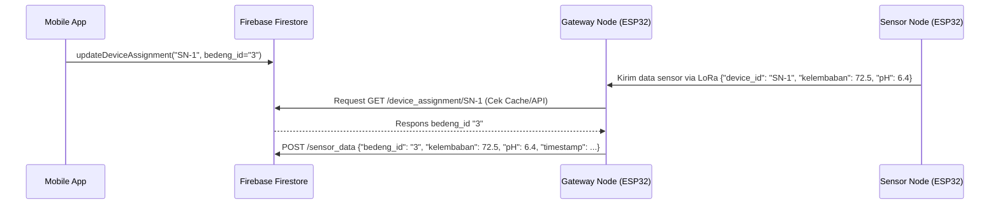

# Panduan Wiring & Pengujian Sensor IoT (ESP32)

Dokumentasi ini berisi diagram perkabelan (wiring) dan petunjuk langkah-demi-langkah untuk merangkai **ESP32**, **Sensor Kelembaban Tanah (Analog)**, **Sensor pH Tanah (RS485)**, **Sensor NPK Tanah (RS485)**, serta modul komunikasi **LoRa (Ra-02)** menggunakan **MAX485** sebagai jembatan TTL ke RS485.

---

## 1. Skema Wiring (Pin Connection)

### A. ESP32 ke MAX485 (Transceiver RS485)
Modul MAX485 digunakan untuk menerjemahkan komunikasi serial TTL dari ESP32 (Hardware Serial 2) menjadi sinyal RS485 agar dapat berkomunikasi dengan sensor industri pH & NPK.

| ESP32 Pin | MAX485 Pin | Deskripsi |
|---|---|---|
| **GPIO 17 (TX2)** | **DI (Data In)** | Mengirim data dari ESP32 ke RS485 |
| **GPIO 16 (RX2)** | **RO (Receiver Out)** | Menerima data dari RS485 ke ESP32 |
| **GPIO 4** | **DE & RE** (Tied) | Kontrol Arah Data (HIGH = Transmit, LOW = Receive) |
| **5V / VIN** | **VCC** | Sumber tegangan 5V |
| **GND** | **GND** | Ground bersama |

### B. MAX485 ke Sensor Tanah (Modbus RTU)
Sensor pH dan NPK menggunakan protokol Modbus RTU via RS485 secara paralel (Daisy-chained).

| MAX485 Pin | Pin Sensor | Deskripsi |
|---|---|---|
| **A** | **A+ / TX+** | Jalur data positif RS485 |
| **B** | **B- / RX-** | Jalur data negatif RS485 |

> [!IMPORTANT]  
> **Daya Sensor Industri**: Sensor pH dan NPK biasanya membutuhkan tegangan masukan **9V - 24V DC**. Gunakan power supply eksternal (misal baterai 9V/12V atau adaptor) untuk menghidupkan sensor. Hubungkan Ground power supply eksternal dengan Ground ESP32 agar referensi tegangan sama.

### C. ESP32 ke Sensor Kelembaban Tanah (Capacitive Soil Moisture v1.2)
| ESP32 Pin | Sensor Pin | Deskripsi |
|---|---|---|
| **3.3V** | **VCC** | Sumber daya 3.3V |
| **GND** | **GND** | Ground |
| **GPIO 34 (ADC1_CH6)** | **AOUT / ADO** | Keluaran sinyal analog ke ADC ESP32 |

### D. ESP32 ke Modul LoRa (Ra-02 SX1278 433MHz / 915MHz)
Modul LoRa berkomunikasi menggunakan protokol SPI.

| ESP32 Pin | LoRa Ra-02 Pin | Deskripsi |
|---|---|---|
| **3.3V** (Maksimal!) | **3.3V** | Sumber daya LoRa (Jangan gunakan 5V!) |
| **GND** | **GND** | Ground |
| **GPIO 5 (SS / CS)** | **NSS** | SPI Chip Select |
| **GPIO 18 (SCK)** | **SCK** | SPI Clock |
| **GPIO 19 (MISO)** | **MISO** | SPI Master In Slave Out |
| **GPIO 23 (MOSI)** | **MOSI** | SPI Master Out Slave In |
| **GPIO 14** | **RST** | Reset Pin |
| **GPIO 2** | **DIO0** | Interrupt Pin (Untuk deteksi paket masuk) |

---

## 2. Cara Kerja & Pengunggahan Kode (Uploading)

Sistem ini terdiri dari dua perangkat mikrokontroler ESP32:

### A. ESP32 Node Sensor (Sender)
Perangkat ini diletakkan langsung di demplot pertanian untuk membaca sensor tanah dan mengirimkannya secara nirkabel via LoRa.
1. Hubungkan ESP32 Node Sensor ke komputer Anda.
2. Buka berkas [pantau_sensor_node.ino](./pantau_sensor_node.ino) menggunakan **Arduino IDE**.
3. Pasang library berikut melalui menu **Tools > Manage Libraries...**:
   - **LoRa** (oleh *Sandeep Mistry*)
4. Pastikan pilihan board diatur ke **ESP32 Dev Module** dan pilih Port USB yang sesuai.
5. Unggah (*Upload*) kode program.
6. Buka **Serial Monitor** pada baudrate `115200` untuk memantau pembacaan sensor fisik.

### B. ESP32 Gateway (Receiver)
Perangkat ini diletakkan di area yang terjangkau jaringan Wi-Fi untuk menerima paket data LoRa lalu mengirimkannya langsung ke database Firebase Firestore menggunakan HTTPS REST API.
1. Hubungkan ESP32 Gateway ke komputer Anda.
2. Buka berkas [pantau_gateway_node.ino](./pantau_gateway_node.ino) menggunakan **Arduino IDE**.
3. Di dalam kode, sesuaikan konfigurasi Wi-Fi dan kredensial Firebase Anda:
   ```cpp
   const char* ssid = "NAMA_WIFI_ANDA";
   const char* password = "PASSWORD_WIFI_ANDA";
   const char* firebase_project_id = "pantau-apps-hma2026";
   const char* firebase_api_key = "AIzaSy...";
   ```
4. Pasang library tambahan berikut melalui Library Manager:
   - **ArduinoJson** (oleh *Benoît Blanchon*)
5. Unggah (*Upload*) kode program.
6. Buka **Serial Monitor** pada baudrate `115200` untuk memantau status sambungan Wi-Fi, sinkronisasi NTP, dan lalu lintas pengunggahan data sensor ke Firestore.

### C. Keamanan & Perbedaan Kredensial Firebase (Web API Key vs Service Account)
Sangat penting untuk memahami perbedaan dua jenis kredensial Firebase berikut demi keamanan sistem:
* **Firebase Web API Key (Client-side / Public)**:
  * Dimasukkan ke dalam berkas `pantau_gateway_node.ino` (`firebase_api_key`).
  * Bersifat publik dan aman jika tertanam di perangkat keras lapangan karena tingkat hak aksesnya dibatasi secara ketat oleh **Firestore Security Rules** yang mewajibkan validasi field tertentu.
* **Service Account Key (Server-side / Private)**:
  * Berupa berkas JSON rahasia yang diunduh dari Firebase Console.
  * **HANYA** digunakan oleh Backend Node.js admin SDK untuk memotong aturan keamanan secara administratif.
  * **JANGAN PERNAH** memasukkan berkas JSON ini atau membocorkan isi kredensialnya ke dalam kode program ESP32 Gateway/Sensor Node, karena dapat disalahgunakan untuk menghapus atau memodifikasi seluruh database tanpa batas!

---

## 3. Menjalankan Integrasi ke Backend & Firestore

Setelah kedua perangkat keras (Sensor Node dan Gateway) aktif:
1. **Gateway Node** akan menerima data dari Sensor Node via LoRa, secara otomatis menyinkronkan waktu dengan NTP, dan melakukan secure POST langsung ke Firestore Database melalui REST API.
2. **Aplikasi Mobile** dapat membaca data sensor terbaru dengan memanggil REST API backend Express.
3. Jalankan server Express backend untuk melayani aplikasi:
   ```bash
   cd backend
   npm install
   npm start
   ```

---

## 4. Fitur Penempatan Alat (Device Assignment) via Aplikasi

Untuk mempermudah penempatan sensor di lapangan tanpa memerlukan DIP Switch fisik, setiap Sensor Node memiliki `DEVICE_ID` tetap (misalnya `SN-1` atau `SN-2`). Penentuan posisi bedeng aktif dikonfigurasi secara nirkabel melalui aplikasi mobile PANTAU.

### A. Alur Kerja Device Assignment


### B. Prosedur Relokasi Alat di Lapangan
Bagi petugas operasional lapangan, ikuti prosedur berikut saat memindahkan alat sensor fisik ke bedeng yang lain:
1. Pindahkan dan tancapkan sensor fisik (misalnya unit `SN-1`) di bedeng target yang baru (misalnya **Bedeng 3**).
2. Buka aplikasi **PANTAU** di handphone Anda.
3. Pada halaman **Dashboard**, temukan bagian **"Kelola Penempatan Alat"**.
4. Cari device ID yang bersangkutan (`SN-1`), lalu klik tombol **Pindahkan**.
5. Pilih nomor bedeng target yang baru (**Bedeng 3**), lalu klik **Simpan**.
6. Sistem akan memperbarui pemetaan secara otomatis di Firebase. Gateway Node akan mendeteksi pemindahan ini dalam siklus pembacaan berikutnya (melalui mekanisme cache expiry 3 menit) dan menempelkan `bedeng_id` yang benar secara otomatis tanpa perlu mereboot perangkat keras.


